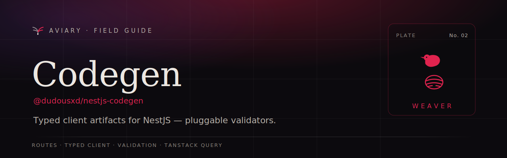

<p align="center">
  <a href="https://davidecarvalho.github.io/aviary/docs/codegen">
    
  </a>
</p>

<p align="center">
  <b><a href="https://davidecarvalho.github.io/aviary/docs/codegen">📖 Read the documentation</a></b>
  &nbsp;·&nbsp; part of the <a href="https://davidecarvalho.github.io/aviary/"><b>Aviary</b></a> ecosystem for NestJS
</p>

---

# nestjs-codegen

Codegen for **NestJS** — generates typed client artifacts (routes, typed API
client, validation schemas) from your controllers, contracts, and DTOs. This is
the full codegen extracted from
[`nestjs-inertia`](https://github.com/DavideCarvalho/nestjs-inertia) into its own
repo, with pluggable validation, optional TanStack Query / superjson, and built-in
**nestjs-inertia** and **nestjs-filter** integrations.

## Packages

| Package | Role |
|---|---|
| `@dudousxd/nestjs-codegen` | The codegen: discovery (controllers, `defineContract`, DTOs, pages, shared props, filters), emitters (`routes.ts`/`api.ts`/`forms.ts`/`pages.d.ts`/`components.json`), config loader, watch mode, and the `codegen`/`init`/`doctor` CLI. Bundles the schema IR + zod adapter. |
| `@dudousxd/nestjs-codegen-valibot` | Valibot validation adapter. |
| `@dudousxd/nestjs-codegen-arktype` | ArkType validation adapter. |
| `@dudousxd/nestjs-client` | Framework-neutral runtime (typed fetcher + superjson transformer hook) for generated `api.ts` in plain (non-Inertia) mode. |

## Features

- **Pluggable validation** — a neutral `SchemaNode` IR with adapters for
  [zod](https://zod.dev) (bundled), [valibot](https://valibot.dev), and
  [arktype](https://arktype.io), designed around the
  [Standard Schema](https://standardschema.dev) shape.
- **Optional TanStack Query** — framework-agnostic `queryOptions`/`mutationOptions`.
- **Optional superjson** — a `transformer` on the runtime fetcher round-trips rich
  types (Date, Map, …) end-to-end.
- **nestjs-inertia integration** — `pages.d.ts` + `components.json` + shared-props
  discovery, and Inertia `router` mutations in `api.ts`.
- **nestjs-filter integration** — `@FilterFor`/`@ApplyFilter` discovery emits
  `TypedFilterQuery<…>` against `@dudousxd/nestjs-filter-client`.

## CLI

```bash
# one-shot generate (reads nestjs-inertia.config.ts)
nestjs-codegen codegen
nestjs-codegen codegen --watch     # regenerate on change
nestjs-codegen init                # scaffold config + Inertia app
nestjs-codegen doctor              # diagnose setup
```

## Programmatic

```ts
import { defineConfig, loadConfig, generate, watch } from '@dudousxd/nestjs-codegen';

const config = await loadConfig(process.cwd());
await generate(config /*, routes */);
```

Use a validation lib other than zod by passing the adapter instance:

```ts
import { valibotAdapter } from '@dudousxd/nestjs-codegen-valibot';
// (wired via config — see docs/superpowers/specs)
```

## Development

```bash
pnpm install
pnpm test        # 522 tests
pnpm typecheck
pnpm build
pnpm lint
```
